# Week 4: Azure Cloud Fundamentals and Data Pipeline Implementation Using Azure Data Factory (ADF)

## 📌 Project Overview

The objective of this week's assignment was to understand Azure cloud fundamentals and build an end-to-end data pipeline using Azure Storage Account and Azure Data Factory (ADF).

The project demonstrates how Azure Data Factory connects to Azure Blob Storage using a Linked Service, validates the source file using the **Get Metadata** activity, and copies data from a source blob to a destination blob using the **Copy Data** activity.

---

## 🏗️ Architecture

```text
             Sample - Superstore.csv
                     │
                     ▼
      Azure Blob Storage (Source)
                     │
                     ▼
        Azure Data Factory (ADF)
                     │
          ┌──────────┴──────────┐
          │                     │
          ▼                     ▼
    Get Metadata          Copy Data
          │                     │
          └──────────┬──────────┘
                     │
                     ▼
     Copied-Superstore.csv
Azure Blob Storage (Destination)
```

---

## ☁️ Azure Services Used

- Azure Resource Group
- Azure Storage Account
- Azure Blob Storage
- Azure Data Factory (V2)
- Linked Service
- Source Dataset
- Destination Dataset
- Get Metadata Activity
- Copy Data Activity
- Azure IAM (RBAC)

---

# 🚀 Implementation Steps

## Step 1: Create Resource Group

A Resource Group was created to organize all Azure resources required for this project.

**Configuration**

- **Resource Group:** `celebal-rg`
- **Region:** Central India

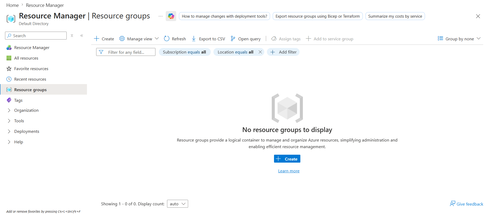

---

## Step 2: Create Storage Account and Blob Container

An Azure Storage Account was created to store the dataset.

A Blob Container named **superstore-data** was created, and the **Sample - Superstore.csv** dataset was uploaded.

**Configuration**

- **Storage Account:** `celebalstorage82715`
- **Container:** `superstore-data`
- **Source File:** `Sample - Superstore.csv`

### Storage Account

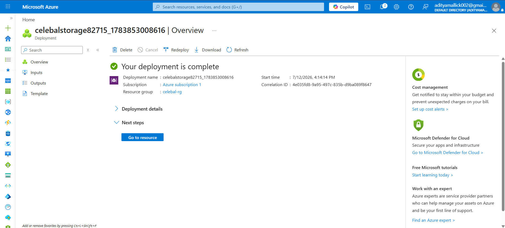

### Blob Container

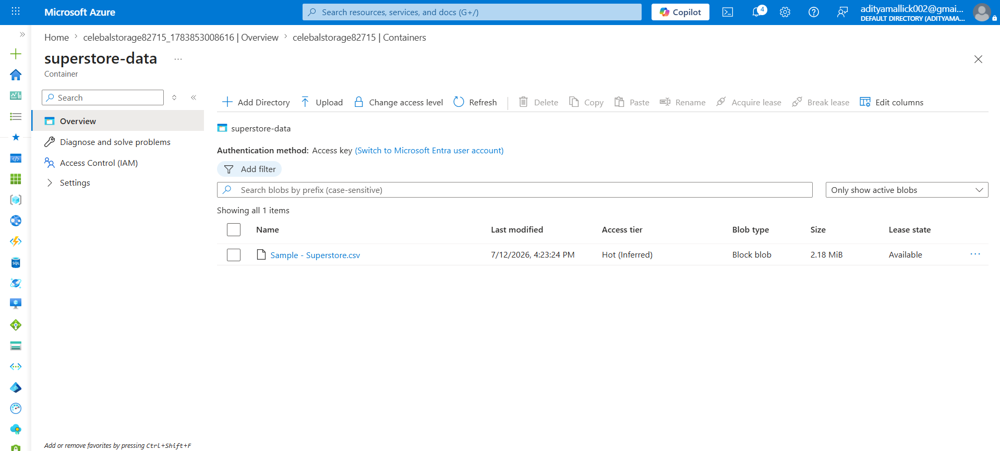

---

## Step 3: Create Azure Data Factory

An Azure Data Factory (ADF) instance was created to orchestrate the complete data pipeline.

**Configuration**

- **ADF Name:** `celebal-adf82715`

### Azure Data Factory Overview

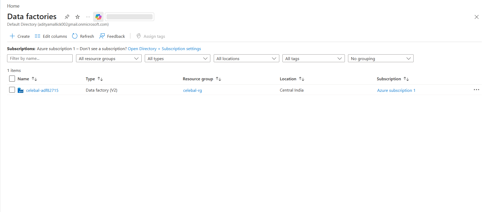

### Azure Data Factory Studio

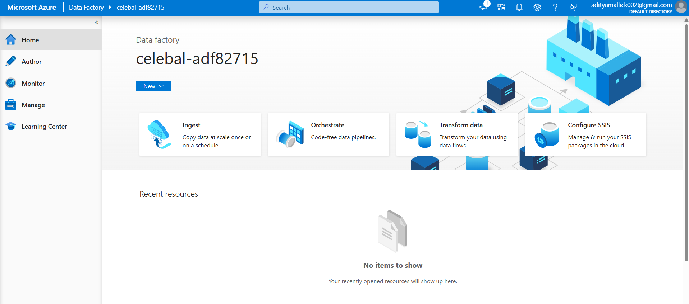

---

## Step 4: Configure Linked Service and Datasets

A **Linked Service** was created to establish a secure connection between Azure Data Factory and Azure Blob Storage.

Two datasets were configured:

- **DS_Source** – Points to the source CSV file.
- **DS_Destination** – Points to the destination CSV file where copied data will be stored.

### Linked Service

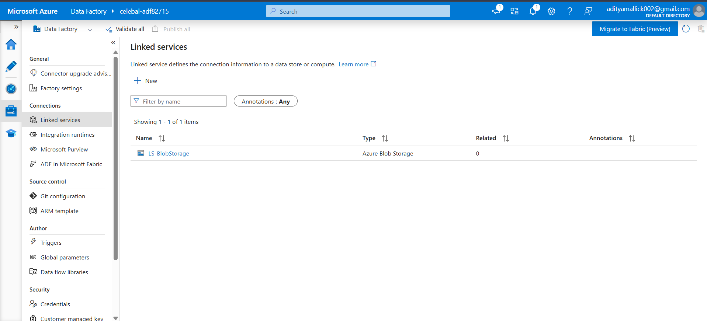

### Source and Destination Datasets

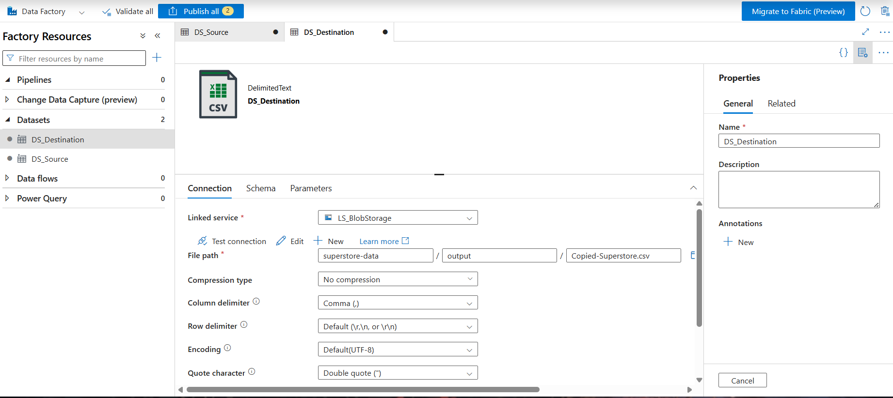

---

## Step 5: Configure Get Metadata Activity

The **Get Metadata** activity was added to the pipeline to validate the source file before copying.

The following metadata properties were retrieved:

- Exists
- Size
- Last Modified

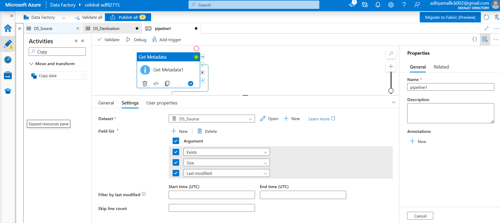

---

## Step 6: Build the Data Pipeline

A pipeline was created using two Azure Data Factory activities:

1. **Get Metadata**
2. **Copy Data**

Pipeline Flow:

```text
Get Metadata
      │
      ▼
Copy Data
```

The Get Metadata activity validates the source file before the Copy Data activity transfers it to the destination location.

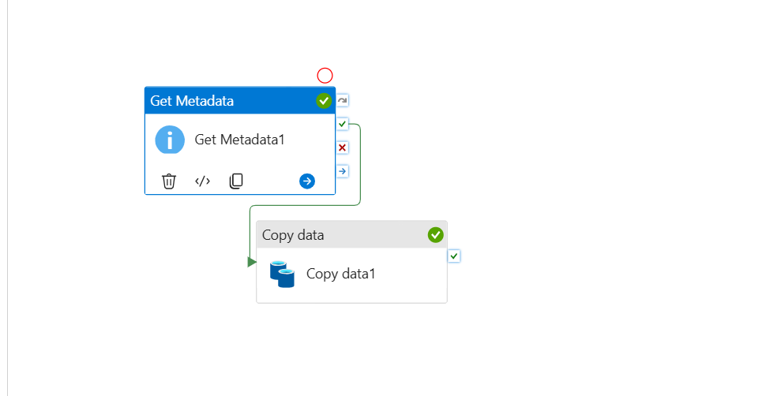

---

## Step 7: Execute and Monitor the Pipeline

The pipeline was executed using the **Debug** option in Azure Data Factory.

Execution Status:

- ✅ Succeeded

The execution was monitored through the Azure Data Factory Monitor section.

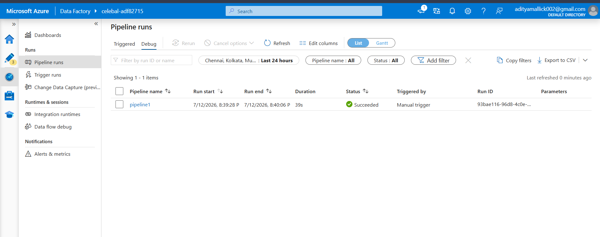

---

## Step 8: Verify Output

After successful execution, the destination file was created successfully inside the Blob Storage destination location.

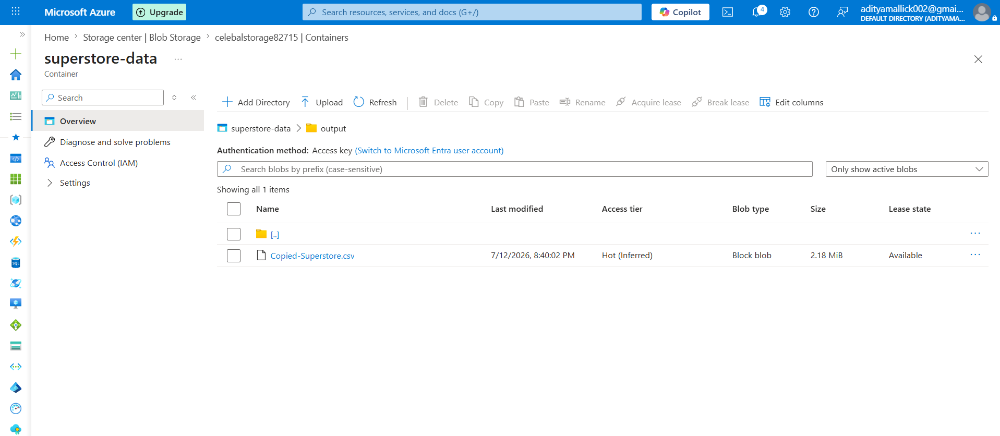

---

## Step 9: Configure Identity and Access Management (IAM)

Azure Role-Based Access Control (RBAC) was configured to provide Azure Data Factory with the required permissions to access Azure Storage.

Assigned Roles:

- Reader
- Storage Blob Data Contributor

These roles allow Azure Data Factory to securely read and write data without exposing storage account credentials.

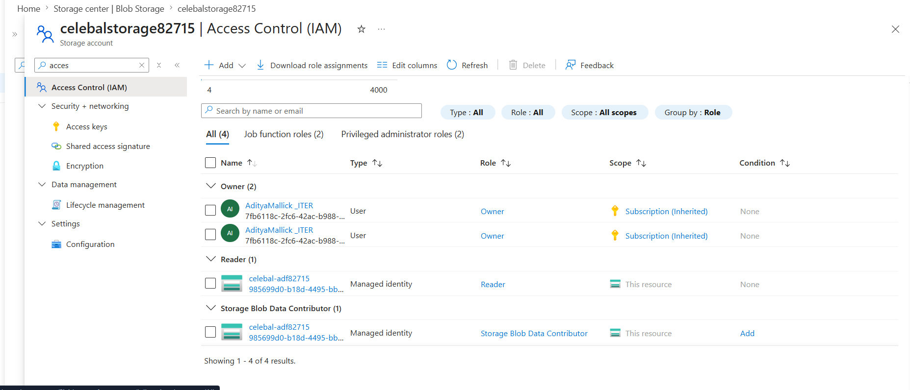

---

# 🏆 Mini Project

An end-to-end Azure Data Factory pipeline was implemented to automate data movement between Azure Blob Storage locations.

### Workflow

```text
Azure Blob Storage (Source)
          │
          ▼
    Get Metadata
          │
          ▼
      Copy Data
          │
          ▼
Azure Blob Storage (Destination)
```

### Outcome

- Source CSV validated using Get Metadata.
- Data copied successfully to the destination Blob Storage.
- Pipeline executed successfully.
- Azure IAM roles configured for secure resource access.

---

# 📊 Project Outcome

Successfully implemented an end-to-end Azure cloud data pipeline that:

- Created Azure cloud resources.
- Configured Azure Storage Account and Blob Container.
- Uploaded the Superstore dataset.
- Connected Azure Data Factory to Blob Storage.
- Retrieved file metadata before processing.
- Copied data from the source blob to the destination blob.
- Successfully executed and monitored the pipeline.
- Configured Azure IAM roles for secure access.

---

# 📚 Key Learnings

- Understanding Azure Resource Groups.
- Creating and managing Azure Storage Accounts.
- Working with Azure Blob Storage.
- Creating Linked Services and Datasets in Azure Data Factory.
- Building data pipelines using Get Metadata and Copy Data activities.
- Executing and monitoring Azure Data Factory pipelines.
- Implementing secure access using Azure IAM (RBAC).

---

## 📂 Repository Structure

```text
Week-04-Azure-Cloud-and-ADF/
│
├── README.md
└── screenshots/
    ├── 01-resource-group.png
    ├── 02-storage-account.png
    ├── 03-blob-container.png
    ├── 04-adf-overview.png
    ├── 05-adf-studio.png
    ├── 06-linked-service.png
    ├── 07-datasets.png
    ├── 08-get-metadata.png
    ├── 09-pipeline-design.png
    ├── 10-pipeline-success.png
    ├── 11-output-blob.png
    └── 12-iam-roles.png
```

---

## 🛠️ Technologies Used

- Microsoft Azure
- Azure Resource Group
- Azure Storage Account
- Azure Blob Storage
- Azure Data Factory (ADF)
- Azure IAM (RBAC)
- Git
- GitHub
- Visual Studio Code

---

## 👨‍💻 Author

**Aditya Mallick**

Celebal Technologies Data Engineering Internship (CEI 2026)